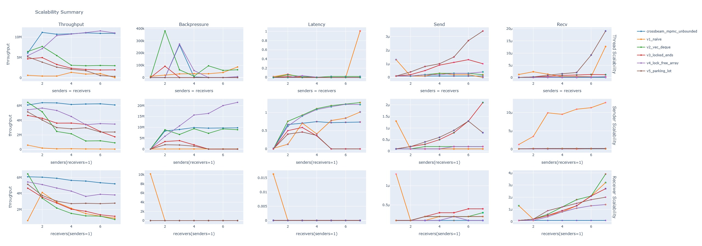
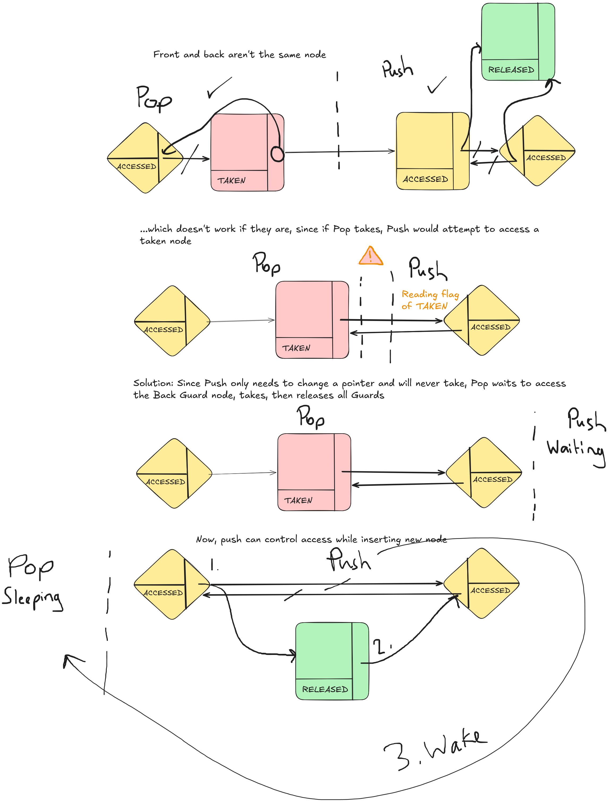

# Multi-Producer, Multi-Consumer Channel

*Check releases for all plots*

An MPMC unbounded concurrent queue, a custom benchmark engine, and an optimized event aggregator.

Used `Miri` to flag unsoundness and undefined behavior when using `unsafe`.

Used industry-standard tools like `cargo-flamegraph` to discover optimization opportunities resulting in a 44.6x speedup for the aggregator.

Benchmarked multiple implementations against the unbounded MPMC channel from `crossbeam` (a popular crate).

## Results

Each test ran for 3 seconds with 4 bytes of data per message.

Below is a set of plots, each showing how each channel scales with the number of readers and writers according to metrics of interest.

| Metric | Unit | Description |
| :----- | :--: | :---------- |
| Throughput | elements/second | Mean estimated rate at which data moves through the channel (from creation to consumption). |
| Backpressure | elements | Mean number of elements present during the run. |
| Latency | seconds/element | Mean time for an element to get popped.|
| Send | seconds/send | Mean time for a call to `send` to complete. |
| Recv | seconds/recv | Mean time for a call to `recv` to complete. |

*Note: V1, V2, V4, V5 were all pre-allocated with a capacity for 100,000,000 items to avoid re-allocations for these tests. Results of those versions may not have accurate tail latencies in scenarios where large pre-allocations aren't available.*

## Takeaways

### Lock-Based Synchronization

All the lock-based implementations (V1, V2, V3, V5) almost always perform worse with more senders and receivers, even when there is a 1:1 ratio between them.

For V3, there can be, at most, 1 sender and 1 receiver moving values at any given time. For V5, there can be any number of threads moving values, or there can be a single sender performing a resize. For V1 and V2, there can only be one thread doing anything at all.

This is not an issue when there's work to do with the values. For example, a common application of unbounded channels is to use them as a background task queue. Consumers need to execute each task and this gives other threads a chance to use the channel with less contention. In those scenarios, we expect that more threads (up to a point, more on that in the next section) result in better performance.

However, in this benchmark, we drop values immediately and call `send` or `recv`, requesting a primary lock again. A receiver does no work so it already goes as fast as a single thread can go. To see why performance doesn't just flatline and actually degrades, we need to look at the cost of synchronization.

### Synchronization and Scalability

All channel implementations involve some sort of synchronization mechanism, whether that is an atomic value or a lock, and whether it's a central synchronization point or more complex.

In any case, the amount of work needed to synchronize scales up with the number of threads actively synchronizing at any given point in time. This almost always applies here since little work is done with the actual values during the benchmark and values are being pushed and popped frequently. Because of this, there exists some number of threads where the synchronization overhead overwhelms any marginal performance gain from adding another thread.

We see this happening in the first throughput plot. For `crossbeam` and V4, they reach a point of no improvement at around 3 senders and 3 receivers. For other versions, we see the additional synchronization overhead overwhelm at 2 senders and 2 receivers and see performance get worse.

## Implementation

### Version 1

Implemented as a `Vec`, guarded by a `Mutex`, and shared by `Arc`. Receivers pop using `remove(0)` and busy-wait (with `sleep`) until there is an item in the queue, or the queue is empty and the sender count is 0. Senders add to the queue if the receiver count is >0.

### Version 2

Uses a `VecDeque` (Ring-Buffer) instead of a `Vec` and is guarded by a `Mutex`. Basic optimization but results in a significantly better channel. This is because popping an element off a ring buffer involves updating the start index and is O(1), while popping off a regular array requires shifting every element back a position and is O(n). 

### Version 3

Implemented as a concurrent linked-list using atomics and a dummy node at each end. Functionally works as a list with a spin-lock at each end. Popping an element requires reserving the first 3 nodes (head dummy, node-to-pop, next node or tail dummy) and pushing a node requires the last 2 (tail dummy, tail node or front dummy). Dummy nodes can never be taken and this allows them to guard the rest of the list and hold a `next` pointer. This mechanism ensures a node being taken is never concurrently being accessed by preventing its neighbors from being accessed.

### Version 4

Implemented as a concurrent array using atomics and re-usable slots. To meet the requirement of being unbounded, a mechanism for re-allocating the array was created involving stateful accesses. Senders and receivers maintain a status flag on whether they are performing an operation, have acknowledged a resize request, or are idle. They can also be set to `ExternallyBlocked` by another actor in which case a compare-and-swap attempting to change from `Idle` to `Reading` or `Writing` would fail and can be used as an exclusivity mechanism.

### Version 5

Similar to Version 4, except that it uses a `parking_lot` (external crate) Read-Write lock for exclusivity. "Reads" involve pushing and popping elements while "Writes" involve any operations which may re-allocate the underlying buffer. Pushing and popping elements can be done through shared accesses since each re-usable slot holds a Mutex.

### Crossbeam's Unbounded Channel

They implemented it as a linked-list of blocks, each with a constant number of slots that can each hold an item. Unlike my implementations, these blocks get created and dropped as-needed and are significantly more memory-efficient. The head and tail pointers are shared across all readers and writers and get updated atomically.

## Benchmark

A thread is spawned for each receiver and sender. Senders call `send` as many times as possible and receivers attempt to `recv` all events in the channel for some number of seconds.

Each event contains:

- Start time
- End time
- ID
- Backpressure

After the benchmark is run, events recorded by senders are matched with ones from receivers and an aggregation is run across all complete and partial (sender/receiver half only) event data.

- Can be found primarily at `bench/src/runner.rs` and `bench/src/test/*`

### Optimizations

- Used a raw binary encoding for event files instead of UTF-8
- Delegated full-event re-construction to the aggregator, to avoid synchronizing senders and receivers
- Tree-like structure for benchmark runners
    - They write to file as soon as a thread is done with its work, avoid writing gigabytes of data all at once
    - Each thread can record its own events without contending with others

## Aggregator

Collects raw data from the Benchmark and produces useful aggregations such as throughput, send/recv delay values, data latency values, etc. for plotting.

- Can be found primarily at `bench/src/aggregate.rs` and `bench/src/aggregate/metric.rs`

### Optimization Round 1

*Note: these times were measured once and there may be some hidden variance unaccounted for. Round 2 uses a more appropriate approach.*

- `13.4 GB` of raw benchmark data
- Initial result: `400.32s`
- Final result: `8.98s` (`44.6x` speedup) with all optimizations

#### Speedup 1: Lazy Errors in Hot Loops

Time down to `305.34s`

- Lazily evaluating error string in `LazyWindowedMetric::add` on Option value (using `ok_or_else` instead of `ok_or`) which saved a String allocation in a hot loop

#### Speedup 2: Sorting at the End Instead of Inserting in Sorted Order

Time down to `94.60s`

- Sorting aggregation bucket values lazily in `LazyWindowedMetric::generate` 
- Meaning there are no more inserts inside each bucket, only pushes at their ends
- No longer using sorted values in `LazyWindowedMetric::generate_gauged` (was only necessary to find percentiles)

#### Speedup 3: Lists instead of Hash-Maps

Time down to `29.70s`

- `Vec` instead of `HashMap` for `u64` keys
    - Had to update benchmark runner to reset event ids to 0 for each run
- Estimating number of events by summing file sizes then pre-allocating entire `Vec` at the start

#### Speedup 4: Multithreading

Time down to `8.98s`

- Spawned a thread for each run (version/config pair)

### Optimization Round 2

- `101 GB` of raw benchmark data (almost 10x more data)

`hyperfine` initial result (3 warmups, 10 runs): 

- Mean: `304s`
- Standard deviation: `160s` (very high!)
- Range: `176s - 583s`
- User Time: `142s`
- System Time: `125s`

#### Speedup 1: Memory-Mapped Raw Benchmark Data

- Every raw benchmark binary data file was memory-mapped (using crate `memmap2`)

`hyperfine` result (3 warmups, 10 runs): 

- Mean: `140s` (**2.2x improvement**)
- Standard deviation: `70s`
- Range: `71s - 277s`
- User Time: `199s`
- System Time: `154s` (this and User Time went up due to less IO leading to better CPU utilization)

## Run

Everything was tested and run with:

- Rust v1.96.0
- Python v3.14.5 (regular version, not the free-threaded/GIL-disabled version)
- Google Chrome (needed by kaleido to create images of the plots)

`./run.sh bench aggregate plot` or `./run.sh` to run all stages

- Exclude any argument to run only specified stages

Plots: `output/plots/*.html` or `output/plots/*.jpg`

## AI Usage

The python code for plotting was AI-assisted.
